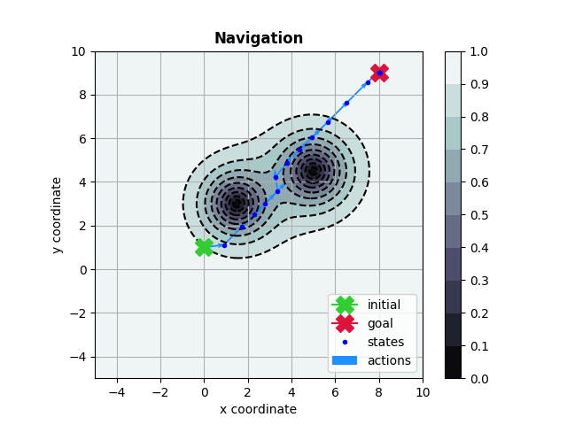

# tf-plan [](https://travis-ci.org/thiagopbueno/tf-plan) [](https://tf-plan.readthedocs.io/en/latest/?badge=latest) [](https://github.com/thiagopbueno/tf-plan/blob/master/LICENSE)

Planning via gradient-based optimization in continuous MDPs using TensorFlow.

**tf-plan** is an implementation based on the NIPS 2017 paper:

> Wu Ga, Buser Say, and Scott Sanner, 2017<br>
> **[Scalable Planning with Tensorflow for Hybrid Nonlinear Domains.](http://papers.nips.cc/paper/7207-scalable-planning-with-tensorflow-for-hybrid-nonlinear-domains.pdf)**<br>
> In Advances in *Neural Information Processing Systems* (pp. 6273-6283).


# Quickstart

**tf-plan** is a Python3.5+ package available in PyPI.

```text
$ pip3 install tf-plan
```

# Features

**tf-plan** solves discrete time MDPs with continuous state-action spaces and deterministic transitions.

The domains/instances are specified using the [RDDL](http://users.cecs.anu.edu.au/~ssanner/IPPC_2011/RDDL.pdf) language.

It is built on Python3's RDDL toolkit:

- [pyrddl](https://github.com/thiagopbueno/pyrddl): RDDL lexer/parser in Python3.
- [rddlgym](https://github.com/thiagopbueno/rddlgym): A toolkit for working with RDDL domains in Python3.
- [rddl2tf](https://github.com/thiagopbueno/rddl2tf): RDDL2TensorFlow compiler.
- [tf-rddlsim](https://github.com/thiagopbueno/tf-rddlsim): A RDDL simulator running in TensorFlow.

Please refer to the projects' documentation for further details.


# Usage

```text
$ tfplan --help

usage: tfplan [-h] [-m {offline,online}] [-b BATCH_SIZE] [-hr HORIZON]
              [-e EPOCHS] [-lr LEARNING_RATE] [--viz {generic,navigation}]
              [-v]
              rddl

tf-plan (v0.5.0): Planning via gradient-based optimization in TensorFlow.

positional arguments:
  rddl                  RDDL file or rddlgym domain id

optional arguments:
  -h, --help            show this help message and exit
  -m {offline,online}, --mode {offline,online}
                        planning mode (default=offline)
  -b BATCH_SIZE, --batch-size BATCH_SIZE
                        number of trajectories in a batch (default=128)
  -hr HORIZON, --horizon HORIZON
                        number of timesteps (default=40)
  -e EPOCHS, --epochs EPOCHS
                        number of timesteps (default=500)
  -lr LEARNING_RATE, --learning-rate LEARNING_RATE
                        optimizer learning rate (default=0.001)
  --viz {generic,navigation}
                        type of visualizer (default=generic)
  -v, --verbose         verbosity mode
```

## Examples

### Navigation

```text
$ tfplan Navigation-v1 -b 32 -hr 15 -e 1000 -v --viz=navigation

Running tf-plan v0.5.0 ...
>> RDDL:            Navigation-v1
>> Planning mode:   offline
>> Horizon:         15
>> Batch size:      32
>> Training epochs: 1000
>> Learning rate:   0.01

Epoch   999: loss = 6879.5073244
>> total reward = -82.927887
```



### HVAC

```text
$ tfplan HVAC-V1 -b 64 -hr 40 -e 1000 --viz=generic

Epoch   999: loss = 58134777856.00000000
>> total reward = -241098.296875
```


# Documentation

Please refer to [https://tf-plan.readthedocs.io/](https://tf-plan.readthedocs.io/) for the code documentation.

# Support

If you are having issues with tf-plan, please let me know at: [thiago.pbueno@gmail.com](mailto://thiago.pbueno@gmail.com).

# License

Copyright (c) 2018-2019 Thiago Pereira Bueno All Rights Reserved.

tf-plan is free software: you can redistribute it and/or modify it
under the terms of the GNU Lesser General Public License as published by
the Free Software Foundation, either version 3 of the License, or (at
your option) any later version.

tf-plan is distributed in the hope that it will be useful, but
WITHOUT ANY WARRANTY; without even the implied warranty of
MERCHANTABILITY or FITNESS FOR A PARTICULAR PURPOSE. See the GNU Lesser
General Public License for more details.

You should have received a copy of the GNU Lesser General Public License
along with tf-plan. If not, see http://www.gnu.org/licenses/.
